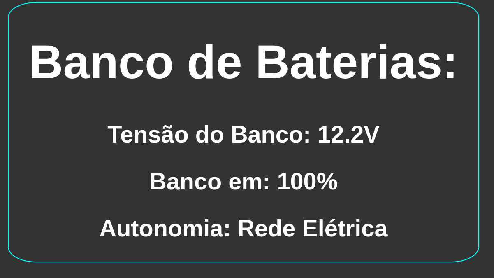

# battMonitor
Embarcado com Arduino e Shield Ethernet para Monitoramento de Banco de Baterias.


## Descrição
Este projeto utiliza um Arduino Nano com um shield Ethernet para criar um servidor web que exibe informações sobre a tensão de um banco de baterias. A interface web mostra a tensão atual, a porcentagem de carga e a autonomia estimada do banco de baterias.

## Configuração
### Conexão Ethernet
A conexão Ethernet é configurada com os seguintes parâmetros:

```
byte mac[] = { 0xDE, 0xAD, 0xBE, 0xEF, 0xFE, 0xED };
IPAddress ip(172, 20, 252, 2);
EthernetServer server(55000);
```
Nesse exemplo, as informações do Banco de Baterias seriam exibidas pelo ip 172.20.252.2

## Página Web
A página web é gerada pelo Arduino e apresenta as seguintes informações:
```
<!DOCTYPE html>
<html lang="pt-br">
<head>
  <meta charset="UTF-8">
  <title>Battery Monitor</title>
  
</head>
<body>
  <div class="painel">
    <h1>Banco de Baterias:</h1>
    <h2>Tensão do Banco: {voltageStable}V</h2>
    <h2>Banco em: {bat_percentage}%</h2>
    <h2>Autonomia: {str_autonomy}</h2>
  </div>
</body>
</html>
```


## Leitura da Tensão
A leitura da tensão é realizada através da porta A0 do Arduino. Como a tensão máxima permitida na porta é de 5 Vdc, um divisor de tensão é utilizado. No primeiro teste, foi utilizado um divisor de tensão com resistores para um banco de baterias de 12 Vdc.

## Problemas Encontrados
Durante os testes, foi observada uma oscilação na leitura da tensão quando o banco estava conectado ao nobreak. Inicialmente, foi testado um filtro capacitivo, mas não houve sucesso. Atualmente, a solução para essa oscilação está sendo desenvolvida via código.

## Considerações Finais
Até o momento, o projeto não foi testado com outros tipos de nobreak. Não há informações sobre se a oscilação ocorre com outras marcas e modelos.


